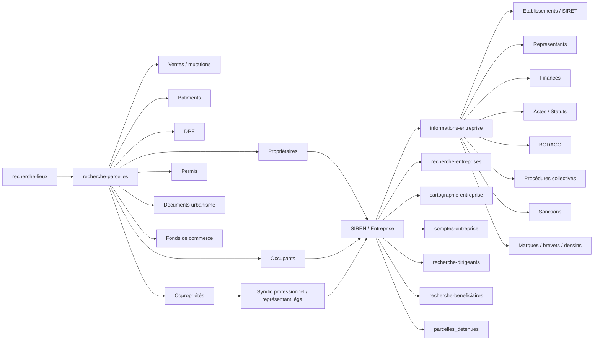

# Cartographie globale

## Principe général

Pappers fonctionne comme un graphe de données autour de quelques identifiants centraux :

| Domaine | Identifiant principal | Identifiants secondaires |
|---|---:|---|
| Entreprise | `siren` | `siret`, `nic`, `numero_rcs`, `code_greffe` |
| Établissement | `siret` | `nic`, adresse, `code_commune` |
| Dirigeant personne physique | pas d’ID stable exposé dans les exemples | nom, prénom, date de naissance, qualité |
| Dirigeant personne morale | `siren` | dénomination, forme juridique |
| Parcelle | `numero` / `parcelle_cadastrale` | section, préfixe, numéro plan |
| Bâtiment | `batiment_groupe_id` | parcelle principale |
| DPE | `identifiant_dpe` | `batiment_groupe_id`, parcelle |
| Copropriété | `numero_immatriculation` | nom, parcelles, syndic |
| Vente | `id` quand disponible | date, lots, parcelles associées |
| Document | `token`, `id`, `documentIds` | type, date, fichier |

## Liaison Entreprise ↔ Immobilier

La liaison principale est le `siren` :

- `entreprise.siren`
- `parcelle.proprietaires[].siren`
- `parcelle.occupants[].siren`
- `coproprietes[].syndic_professionnel.siren`
- `coproprietes[].representant_legal.siren`
- `informations-entreprise.parcelles_detenues`
