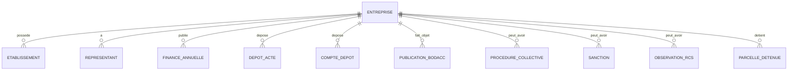

# Entreprises — Vue d'ensemble

## Outils MCP principaux

| Outil | Usage |
|---|---|
| `sirenisateur` | Trouver le SIREN d’une entreprise connue par son nom |
| `recherche-entreprises` | Rechercher des entreprises par critères |
| `informations-entreprise` | Récupérer une fiche complète par SIREN |
| `comptes-entreprise` | Récupérer les comptes annuels et ratios |
| `recherche-dirigeants` | Rechercher des dirigeants |
| `recherche-beneficiaires` | Rechercher des bénéficiaires effectifs |
| `cartographie-entreprise` | Construire un graphe d’entreprise |
| `lire-documents` | Lire des documents à partir de tokens |

## Objet central

L’objet central est l’entreprise identifiée par son `siren`.

Une entreprise peut contenir :

- identité juridique ;
- activité ;
- siège ;
- établissements ;
- représentants ;
- bénéficiaires effectifs ;
- finances ;
- comptes déposés ;
- actes ;
- publications BODACC ;
- procédures collectives ;
- sanctions ;
- observations ;
- parcelles détenues ;
- liens capitalistiques ou cartographiques.

## Modèle général

