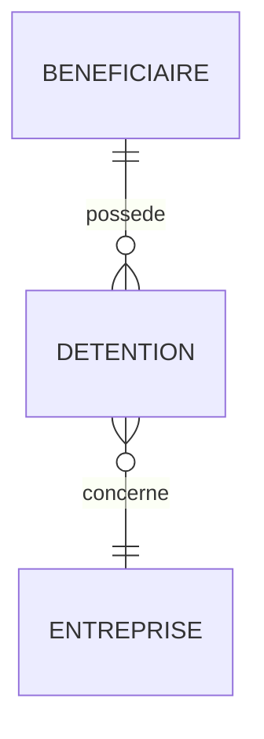

# Schéma — Bénéficiaires effectifs

## Sources

- `informations-entreprise.beneficiaires_effectifs`
- `recherche-beneficiaires`

## Attention habilitation

Dans l’exemple observé, `beneficiaires_effectifs` ne renvoie pas un tableau, mais un message indiquant que l’accès nécessite une habilitation.

Il faut donc gérer deux formes :

```json
{
  "beneficiaires_effectifs": [
    {}
  ]
}
```

ou

```json
{
  "beneficiaires_effectifs": {
    "message": "L'accès aux bénéficiaires effectifs nécessite une habilitation..."
  }
}
```

## Champs disponibles via recherche

| Famille | Champs |
|---|---|
| Identité | `nom`, `nom_usage`, `prenom`, `pseudonyme`, `nom_complet` |
| Naissance | `date_de_naissance_formate`, `date_de_naissance_complete_formatee`, `ville_de_naissance`, `pays_de_naissance` |
| Nationalité | `nationalite`, `codes_nationalites` |
| Détention capital | `pourcentage_parts`, `pourcentage_parts_directes`, `pourcentage_parts_indirectes` |
| Droits de vote | `pourcentage_votes`, `pourcentage_votes_directs`, `pourcentage_votes_indirect` |
| Contrôle | `detention_pouvoir_decision_ag`, `detention_pouvoir_nom_membre_conseil_administration`, `detention_autres_moyens_controle` |
| Représentation | `beneficiaire_representant_legal`, `representant_legal_placement_sans_gestion_delegation` |
| Adresse | `adresse_ligne_1/2/3`, `code_postal`, `ville`, `pays` |
| Liens entreprises | `entreprises`, `nb_entreprises_total`, `entreprises_dirigeant` |

## Modèle conseillé


