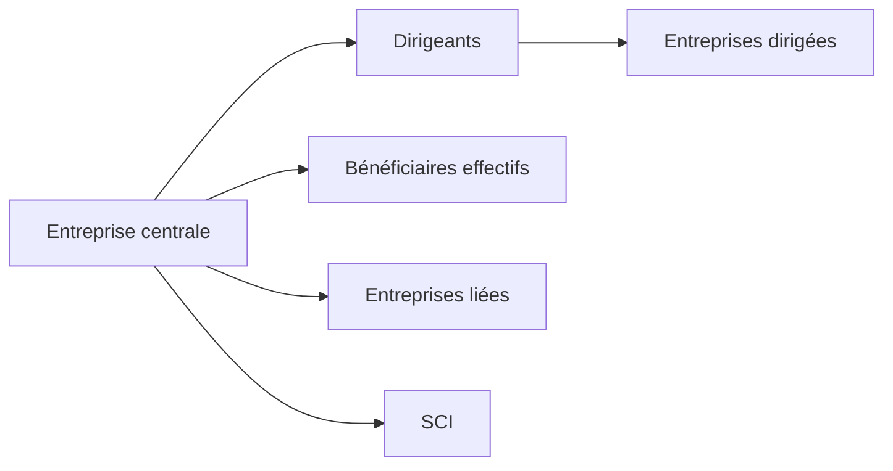

# Schéma — `cartographie-entreprise`

## Usage

Établir une cartographie relationnelle d’une entreprise française à partir de son SIREN.

## Entrée

| Paramètre | Type | Défaut | Commentaire |
|---|---|---:|---|
| `siren` | string | obligatoire | Centre du graphe |
| `inclure_entreprises_dirigees` | boolean | true | Entreprises dirigées par / dirigeant l’entreprise |
| `inclure_entreprises_citees` | boolean | false | Entreprises citées conjointement dans actes et statuts |
| `inclure_sci` | boolean | true | Inclure les SCI |

## Sortie attendue

L’outil retourne des **nœuds** et des **liens** :

## Modèle de graphe conseillé

### Nœuds

- entreprise ;
- personne physique ;
- personne morale ;
- bénéficiaire effectif ;
- entreprise citée ;
- SCI.

### Liens

- dirige ;
- est dirigé par ;
- détient ;
- est bénéficiaire effectif de ;
- cité conjointement ;
- lien SCI.

## Usage économie crédits

À utiliser après une fiche entreprise si le besoin est vraiment relationnel.  
Pour une simple fiche, `informations-entreprise` suffit.
