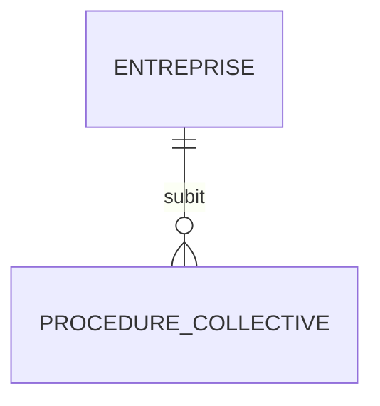

# Schéma — Procédures, sanctions et signaux faibles

## Procédures collectives

Sources :

- `procedures_collectives`
- `procedure_collective_existe`
- `procedure_collective_en_cours`

Modèle conseillé :

Champs exacts à confirmer selon cas positif. Dans l’exemple observé, le tableau était vide.

## Sanctions

Source : `sanctions[]`

Champs observés :

| Champ | Commentaire |
|---|---|
| `autorite` | Autorité |
| `pays` | Pays |
| `code_pays` | Code pays |
| `en_cours` | Booléen |
| `description` | Description |
| `parties` | Parties |
| `montant` | Montant |
| `recours` | Booléen |
| `date_debut` | Date |
| `date_fin` | Date |
| `sources[]` | Sources |

## Observations RCS

Source : `observations[]`

| Champ | Commentaire |
|---|---|
| `numero` | Numéro observation |
| `date_ajout` | Ajout |
| `texte` | Texte |
| `etat` | État |
| `date_modification` | Modification |
| `date_suppression` | Suppression |

## Règles de restitution

- Procédure collective en cours : signaler clairement.
- Sanction en cours : signaler clairement.
- PPE active chez un dirigeant : signaler clairement.
- Actif net inférieur à la moitié du capital : signaler si actif.
