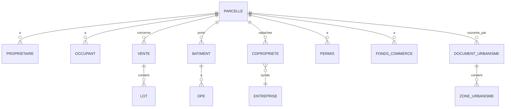

# Immobilier — Vue d'ensemble

## Outils MCP principaux

| Outil | Usage |
|---|---|
| `recherche-lieux` | Géocoder une adresse, une rue, une commune ou une parcelle |
| `recherche-parcelles` | Rechercher des parcelles cadastrales et leurs données associées |
| `informations-entreprise.parcelles_detenues` | Voir les parcelles liées à une entreprise |

## Objet central

L’objet central immobilier est la **parcelle cadastrale**, identifiée par `numero` ou `parcelle_cadastrale`.

Une parcelle peut contenir :

- adresse ;
- contenance ;
- propriétaires ;
- occupants ;
- ventes ;
- bâtiments ;
- DPE ;
- copropriétés ;
- permis ;
- fonds de commerce ;
- documents d’urbanisme ;
- aménagements ;
- statistiques.

## Modèle général

