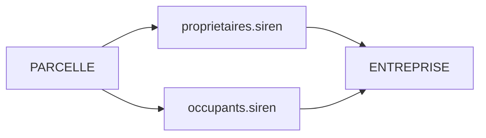

# Schéma — Propriétaires et occupants

## Sources

- `recherche-parcelles.proprietaires[]`
- `recherche-parcelles.occupants[]`

## Propriétaires

Champs possibles via `return_fields` :

| Champ aplati demandé | Résultat observé |
|---|---|
| `proprietaires_siren` | `proprietaires[].siren` |
| `proprietaires_nom_entreprise` | `proprietaires[].nom_entreprise` |
| `proprietaires_date_creation` | Date création |
| `proprietaires_tranche_effectifs` | Tranche |
| `proprietaires_categorie_juridique` | Catégorie |
| `proprietaires_activite_principale` | NAF |
| `proprietaires_cessation_activite` | Booléen |
| `proprietaires_monoproprietaire` | Booléen |
| `proprietaires_proprietaire_occupant` | Booléen |
| `proprietaires_lmnp` | Booléen |
| `proprietaires_locaux` | Locaux |
| `proprietaires_personnes_physiques` | Données personnes physiques |
| `proprietaires_representants_personnes_morales` | Représentants |

## Occupants

Champs possibles :

| Champ | Commentaire |
|---|---|
| `occupants_siren` | SIREN |
| `occupants_siret` | SIRET |
| `occupants_nom_entreprise` | Nom |
| `occupants_enseigne` | Enseigne |
| `occupants_date_creation` | Date création |
| `occupants_fiabilite_appartenance_parcelle` | Fiabilité rattachement |
| `occupants_activite_principale` | Activité entreprise |
| `occupants_activite_principale_etablissement` | Activité établissement |
| `occupants_categorie_juridique` | Catégorie |
| `occupants_cessation_activite` | Cessation |
| `occupants_siege` | Siège |
| `occupants_date_entree_lieux` | Entrée lieux |
| `occupants_etablissement_ferme` | Fermé |
| `occupants_date_sortie_lieux` | Sortie |
| `occupants_procedures_collectives` | Procédures |
| `occupants_finances` | Finances |

## Liaison avec entreprises

Tout `siren` propriétaire ou occupant peut être enrichi par `informations-entreprise`.

