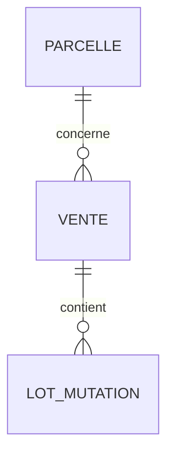

# Schéma — Ventes / mutations

## Source

`recherche-parcelles.ventes[]`

## Champs observés

| Champ | Commentaire |
|---|---|
| `id` | Identifiant vente, parfois null |
| `date` | Date mutation |
| `nature` | Vente, échange, adjudication, etc. |
| `valeur_fonciere` | Prix |
| `type_local` | Appartement, maison, dépendance, local commercial |
| `surface_reelle_bati` | Surface bâtie |
| `surface_reelle_bati_totale` | Surface totale |
| `surface_terrain` | Terrain |
| `nombre_pieces` | Nombre pièces |
| `nombre_lots` | Nombre de lots |
| `parcelles_associees[]` | Parcelles |
| `lots[]` | Lots de copropriété |

## Lots

```json
{
  "numero": "1038",
  "surface_carrez": 116.24
}
```

## Modèle conseillé



## Points d’attention

- Une même vente peut apparaître plusieurs fois pour dépendances, appartement et lots.
- `id` peut être absent.
- Il faut dédoublonner par `id`, `date`, `valeur_fonciere`, parcelle et lots.
