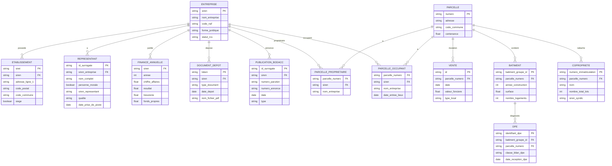

# Graphe entités-relations

```mermaid
erDiagram
    ENTREPRISE {
        string siren PK
        string nom_entreprise
        string code_naf
        string forme_juridique
        string statut_rcs
    }

    ETABLISSEMENT {
        string siret PK
        string siren FK
        string adresse_ligne_1
        string code_postal
        string code_commune
        boolean siege
    }

    REPRESENTANT {
        string id_surrogate PK
        string siren_entreprise FK
        string nom_complet
        boolean personne_morale
        string siren_representant
        string qualite
        date date_prise_de_poste
    }

    FINANCE_ANNUELLE {
        string siren FK
        int annee
        float chiffre_affaires
        float resultat
        float tresorerie
        float fonds_propres
    }

    DOCUMENT_DEPOT {
        string token PK
        string siren FK
        string type_document
        date date_depot
        string nom_fichier_pdf
    }

    PUBLICATION_BODACC {
        string id_surrogate PK
        string siren FK
        string numero_parution
        string numero_annonce
        date date
        string type
    }

    PARCELLE {
        string numero PK
        string adresse
        string code_commune
        float contenance
    }

    PARCELLE_PROPRIETAIRE {
        string parcelle_numero FK
        string siren FK
        string nom_entreprise
    }

    PARCELLE_OCCUPANT {
        string parcelle_numero FK
        string siren FK
        string nom_entreprise
        date date_entree_lieux
    }

    VENTE {
        string id PK
        string parcelle_numero FK
        date date
        float valeur_fonciere
        string type_local
    }

    BATIMENT {
        string batiment_groupe_id PK
        string parcelle_numero FK
        int annee_construction
        float surface
        int nombre_logements
    }

    DPE {
        string identifiant_dpe PK
        string batiment_groupe_id FK
        string parcelle_numero FK
        string classe_bilan_dpe
        date date_reception_dpe
    }

    COPROPRIETE {
        string numero_immatriculation PK
        string parcelle_numero FK
        string nom
        int nombre_total_lots
        string siren_syndic
    }

    ENTREPRISE ||--o{ ETABLISSEMENT : possede
    ENTREPRISE ||--o{ REPRESENTANT : a
    ENTREPRISE ||--o{ FINANCE_ANNUELLE : publie
    ENTREPRISE ||--o{ DOCUMENT_DEPOT : depose
    ENTREPRISE ||--o{ PUBLICATION_BODACC : annonce
    ENTREPRISE ||--o{ PARCELLE_PROPRIETAIRE : proprietaire
    ENTREPRISE ||--o{ PARCELLE_OCCUPANT : occupant
    PARCELLE ||--o{ PARCELLE_PROPRIETAIRE : a
    PARCELLE ||--o{ PARCELLE_OCCUPANT : a
    PARCELLE ||--o{ VENTE : mutation
    PARCELLE ||--o{ BATIMENT : contient
    BATIMENT ||--o{ DPE : diagnostic
    PARCELLE ||--o{ COPROPRIETE : rattache
```
