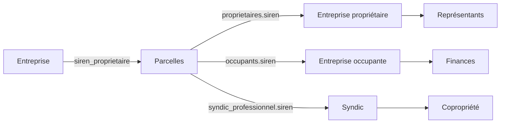

# Playbook — Croiser entreprise et parcelles

## Sens 1 : entreprise vers immobilier

1. Appeler `informations-entreprise` avec `parcelles_detenues`.
2. Si la liste est incomplète ou vide, utiliser `recherche-parcelles` avec `siren_proprietaire`.

```json
{
  "siren_proprietaire": "XXXXXXXXX",
  "return_fields": [
    "numero",
    "adresse",
    "contenance",
    "proprietaires_siren",
    "proprietaires_nom_entreprise",
    "occupants_siren",
    "occupants_nom_entreprise",
    "ventes",
    "coproprietes"
  ]
}
```

## Sens 2 : immobilier vers entreprise

1. Appeler `recherche-parcelles`.
2. Extraire `proprietaires[].siren`, `occupants[].siren`, `coproprietes[].syndic_professionnel.siren`.
3. Enrichir les SIREN pertinents via `informations-entreprise`.

## Graphe utile



## Déduplication

Les mêmes SIREN peuvent apparaître comme :

- propriétaire ;
- occupant ;
- syndic ;
- représentant légal ;
- société dirigeante.
