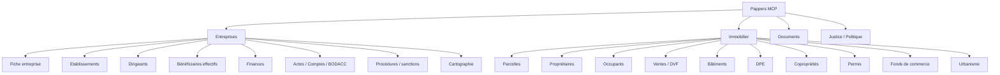
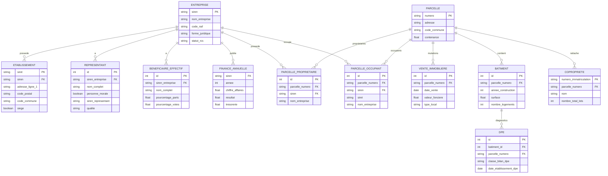

# CLAUDE.md — Pappers MCP / Base Entreprises & Immobilier

> Document de travail pour Claude Code, Cursor, agents IA ou développeurs.
> Objectif : comprendre, exploiter et modéliser la structure Pappers via le MCP, avec un focus prioritaire sur **Entreprises** et **Immobilier**.

---

## 0. Règle absolue : économie des crédits Pappers

Les appels Pappers peuvent consommer des crédits. Le comportement attendu est donc :

1. **Toujours exploiter d'abord les schémas MCP / documentation locale / ce fichier.**
2. **Ne jamais appeler un endpoint complet sans `return_fields`.**
3. **Commencer par les endpoints de recherche légers**, puis enrichir seulement les entités retenues.
4. **Ne jamais appeler les champs de scoring financier/non-financier sans demande explicite.**
5. **Ne jamais lire des documents complets (`lire-documents`) tant qu'un token n'est pas clairement utile.**
6. **Ne jamais faire de recherche large sans filtre géographique, SIREN, adresse, NAF, code commune ou pagination stricte.**
7. **Toujours expliquer pourquoi un appel est nécessaire avant de le faire si l'appel est potentiellement coûteux.**

### Champs coûteux ou sensibles à éviter par défaut

- `scoring_financier`
- `scoring_non_financier`
- `note_scoring_financier_min/max`
- `note_scoring_non_financier_min/max`
- `inclure_bilan_complet`
- `lire-documents`
- champs de contact enrichis : emails, téléphones, sites, réseaux sociaux
- champs supplémentaires immobilier de contacts : `proprietaires.emails`, `occupants.telephones`, etc.

---

## 1. Mission du projet

Construire une base de connaissance et/ou une base SQL inspirée de Pappers, permettant de relier :

- les entreprises françaises ;
- leurs établissements ;
- leurs dirigeants et représentants ;
- leurs bénéficiaires effectifs ;
- leurs comptes, actes, publications, procédures ;
- les parcelles cadastrales ;
- les propriétaires et occupants ;
- les mutations immobilières ;
- les bâtiments, DPE, copropriétés, permis, fonds de commerce et documents d'urbanisme.

Ce fichier ne prétend pas décrire le schéma interne exact de Pappers. Il décrit la **structure exploitable via le MCP/API** et un **modèle relationnel conseillé** pour stocker les données.

---

## 2. Vue d'ensemble des domaines



---

## 3. Outils MCP Pappers pertinents

### 3.1 Entreprises

| Outil MCP | Usage | Consommation conseillée |
|---|---|---|
| `sirenisateur` | Trouver le SIREN à partir d'un nom | Très utile en premier appel si SIREN inconnu |
| `recherche-entreprises` | Recherche multi-critères entreprises | Toujours avec `return_fields` et `par_page` faible |
| `informations-entreprise` | Fiche détaillée entreprise par SIREN | À appeler uniquement sur SIREN retenu |
| `comptes-entreprise` | Comptes annuels et ratios financiers | Seulement si besoin finance précis |
| `recherche-dirigeants` | Recherche de dirigeants | Pour chercher une personne ou les dirigeants associés |
| `recherche-beneficiaires` | Recherche de bénéficiaires effectifs | Ne pas utiliser pour une entreprise précise ; utiliser plutôt `informations-entreprise` |
| `cartographie-entreprise` | Graphe dirigeants / BE / sociétés liées | À réserver aux analyses relationnelles |
| `lire-documents` | Lire actes/statuts/documents à partir de tokens | Dernière étape, uniquement si un document est nécessaire |

### 3.2 Immobilier

| Outil MCP | Usage | Consommation conseillée |
|---|---|---|
| `recherche-lieux` | Géocoder adresse, rue, commune ou parcelle | Premier appel immobilier recommandé |
| `recherche-parcelles` | Recherche cadastre / immobilier enrichi | Endpoint central immobilier |

---

## 4. Ordre d'appel recommandé

### 4.1 Recherche entreprise minimale

```text
1. Si SIREN inconnu : sirenisateur
2. recherche-entreprises avec 5 à 8 champs maximum
3. informations-entreprise sur le SIREN retenu
4. comptes-entreprise si besoin financier
5. cartographie-entreprise si besoin relationnel
6. lire-documents si besoin d'un acte précis
```

### 4.2 Recherche immobilier minimale

```text
1. recherche-lieux pour nettoyer adresse / code commune / coordonnées
2. recherche-parcelles avec return_fields léger
3. enrichir avec ventes / DPE / copro / urbanisme selon besoin
4. appeler informations-entreprise uniquement sur les SIREN propriétaires ou occupants utiles
```

---

## 5. Identifiants principaux

| Entité | Identifiant conseillé | Source |
|---|---|---|
| Entreprise | `siren` | Pappers / INSEE |
| Établissement | `siret` | Sirene |
| Représentant | clé composite ou surrogate key | Pas toujours d'ID unique stable |
| Bénéficiaire effectif | clé composite | Nom + date naissance + SIREN société + date source si disponible |
| Compte annuel | `siren + annee` | Comptes Pappers |
| Dépôt d'acte | token / id document | Pappers |
| Publication BODACC | clé composite | type + date + numéro annonce + SIREN |
| Parcelle | `numero` / parcelle cadastrale complète | Cadastre |
| Vente | clé composite ou hash | parcelle + date + valeur + type local |
| Bâtiment | id Pappers si fourni, sinon hash | parcelle + géométrie/surface/année |
| DPE | identifiant DPE si fourni | ADEME/Pappers |
| Copropriété | `numero_immatriculation` | RNIC |
| Permis | `numero` | Sitadel / urbanisme |
| Fonds de commerce | hash | parcelle + date + prix + annonce BODACC |
| Document urbanisme | `id` | GPU / Pappers |

---

## 6. Structure Entreprises

### 6.1 Entité `Entreprise`

Représente une personne morale ou physique immatriculée.

Champs principaux observables via `informations-entreprise` ou `recherche-entreprises` :

```yaml
entreprise:
  siren: string
  siren_formate: string
  diffusable: boolean
  opposition_utilisation_commerciale: boolean
  nom_entreprise: string
  personne_morale: boolean
  denomination: string
  nom: string
  prenom: string
  sexe: string
  code_naf: string
  libelle_code_naf: string
  nomenclature_code_naf: string
  domaine_activite: string
  conventions_collectives: array
  date_creation: date
  date_creation_formate: string
  entreprise_cessee: boolean
  date_cessation: date
  entreprise_employeuse: boolean
  societe_a_mission: boolean
  categorie_juridique: string
  forme_juridique: string
  micro_entreprise: boolean
  forme_exercice: string
  effectif: string|number|null
  effectif_min: number|null
  effectif_max: number|null
  tranche_effectif: string|null
  annee_effectif: number|null
  capital: number|string|null
  capital_formate: string|null
  devise_capital: string|null
  statut_rcs: string
  statut_rne: string
  statut_consolide: string
  siege: object
  etablissement: object
  etablissements: array
  representants: array
  beneficiaires_effectifs: array
  finances: array
  comptes: array
  depots_actes: array
  publications_bodacc: array
  procedures_collectives: array
  procedure_collective_existe: boolean
  procedure_collective_en_cours: boolean
  sanctions: array
  marques: array
  sites_internet: array
  telephone: string|null
  email: string|null
  labels: object|array
  observations: array
  decisions: array
  parcelles_detenues: array
  entreprises_dirigees: array
  entreprises_citees: array
  filiales: array
  maison_mere: object|null
  actionnaires: array
```

### 6.2 Sous-structure `siege` / `etablissement`

```yaml
etablissement:
  siret: string
  siret_formate: string
  nic: string
  numero_voie: string
  indice_repetition: string
  type_voie: string
  libelle_voie: string
  complement_adresse: string
  adresse_ligne_1: string
  adresse_ligne_2: string
  code_postal: string
  ville: string
  code_commune: string
  commune: string
  pays: string
  code_pays: string
  latitude: number|null
  longitude: number|null
  siege: boolean
  etablissement_cesse: boolean
  date_creation: date
  date_debut_activite: date
  enseigne: string|null
  nom_commercial: string|null
  activite_principale: string
  nomenclature_activite_principale: string
  caractere_employeur: string|boolean|null
  effectif: string|number|null
```

### 6.3 Sous-structure `representants`

Un représentant peut être une personne physique ou morale.

```yaml
representant:
  qualite: string
  personne_morale: boolean
  actuel: boolean
  date_prise_de_poste: date|null
  date_depart_de_poste: date|null

  # si personne physique
  sexe: string|null
  nom: string|null
  prenom: string|null
  prenom_usuel: string|null
  nom_complet: string|null
  date_de_naissance: string|null
  date_de_naissance_formate: string|null
  age: number|null
  nationalite: string|null
  codes_nationalites: array|null
  ville_de_naissance: string|null
  pays_de_naissance: string|null
  adresse_ligne_1: string|null
  adresse_ligne_2: string|null
  adresse_ligne_3: string|null
  code_postal: string|null
  ville: string|null
  pays: string|null

  # si personne morale
  siren: string|null
  denomination: string|null
  forme_juridique: string|null

  entreprises: array|null
  nb_entreprises_total: number|null
```

### 6.4 Sous-structure `beneficiaires_effectifs`

```yaml
beneficiaire_effectif:
  nom: string
  nom_usage: string|null
  prenom: string
  pseudonyme: string|null
  nom_complet: string
  date_de_naissance_formate: string|null
  date_de_naissance_complete_formatee: string|null
  nationalite: string|null
  codes_nationalites: array|null
  pourcentage_parts: number|null
  pourcentage_parts_directes: number|null
  pourcentage_parts_indirectes: number|null
  pourcentage_parts_vocation_titulaire: number|null
  pourcentage_votes: number|null
  pourcentage_votes_directs: number|null
  pourcentage_votes_indirect: number|null
  detention_pouvoir_decision_ag: boolean|null
  detention_pouvoir_nom_membre_conseil_administration: boolean|null
  detention_autres_moyens_controle: boolean|null
  beneficiaire_representant_legal: boolean|null
  representant_legal_placement_sans_gestion_delegation: boolean|null
  adresse_ligne_1: string|null
  adresse_ligne_2: string|null
  adresse_ligne_3: string|null
  code_postal: string|null
  ville: string|null
  pays: string|null
  pays_de_naissance: string|null
  ville_de_naissance: string|null
```

### 6.5 Sous-structure `finances` / `comptes`

Les ratios peuvent être récupérés via `informations-entreprise` ou `comptes-entreprise`.

```yaml
finance_annuelle:
  siren: string
  annee: number
  date_de_cloture_exercice: date|null
  duree_exercice: number|null
  chiffre_affaires: number|null
  resultat: number|null
  effectif: number|null
  marge_brute: number|null
  excedent_brut_exploitation: number|null
  resultat_exploitation: number|null
  taux_croissance_chiffre_affaires: number|null
  taux_marge_brute: number|null
  taux_marge_EBITDA: number|null
  taux_marge_operationnelle: number|null
  BFR: number|null
  BFR_exploitation: number|null
  BFR_hors_exploitation: number|null
  BFR_jours_CA: number|null
  delai_paiement_clients_jours: number|null
  delai_paiement_fournisseurs_jours: number|null
  capacite_autofinancement: number|null
  fonds_roulement_net_global: number|null
  tresorerie: number|null
  dettes_financieres: number|null
  capacite_remboursement: number|null
  ratio_endettement: number|null
  autonomie_financiere: number|null
  liquidite_generale: number|null
  marge_nette: number|null
  rentabilite_fonds_propres: number|null
  rentabilite_economique: number|null
  valeur_ajoutee: number|null
  salaires_charges_sociales: number|null
  impots_taxes: number|null
```

### 6.6 Documents entreprise

```yaml
depot_acte:
  token: string
  date_depot: date
  type: string
  decision: string|null
  actes: array
  nom_fichier_pdf: string|null
  url: string|null

publication_bodacc:
  type: string
  date: date
  numero_parution: string|null
  numero_annonce: string|null
  bodacc: string|null
  texte: string|null

procedure_collective:
  type: string
  date_debut: date|null
  date_fin: date|null
  famille: string|null
  statut: string|null
```

---

## 7. Structure Immobilier

### 7.1 Entité `Parcelle`

Endpoint central : `recherche-parcelles`.

```yaml
parcelle:
  numero: string
  section: string
  prefixe: string
  numero_plan: string
  adresse: string|object|array|null
  code_commune: string
  commune: string
  code_departement: string
  departement: string
  code_region: string
  region: string
  codes_postaux: array
  contenance: number
  arpente: boolean|null
  bounding_box: object|null

  proprietaires: array|null
  occupants: array|null
  ventes: array|null
  batiments: array|null
  dpe: array|null
  fonds_de_commerce: array|null
  coproprietes: array|null
  permis: array|null
  documents_urbanisme: array|null
  amenagements: array|null
  statistiques: object|null
```

### 7.2 Propriétaires

Les propriétaires peuvent être personnes morales ou physiques.

```yaml
proprietaire:
  siren: string|null
  nom_entreprise: string|null
  denomination: string|null
  date_creation: date|null
  tranche_effectifs: string|null
  categorie_juridique: string|null
  activite_principale: string|null
  cessation_activite: boolean|null
  monoproprietaire: boolean|null
  proprietaire_occupant: boolean|null
  lmnp: boolean|null
  locaux: array|null
  personnes_physiques: array|null
  representants_personnes_morales: array|null
  parcelles: array|null
  emails: array|null
  telephones: array|null
  sites_internet: array|null
  lien_linkedin: string|null
```

Champs `return_fields` rapides :

```yaml
- proprietaires_siren
- proprietaires_nom_entreprise
- proprietaires_date_creation
- proprietaires_tranche_effectifs
- proprietaires_categorie_juridique
- proprietaires_activite_principale
- proprietaires_cessation_activite
- proprietaires_monoproprietaire
- proprietaires_proprietaire_occupant
- proprietaires_lmnp
```

### 7.3 Occupants

```yaml
occupant:
  siren: string|null
  siret: string|null
  nom_entreprise: string|null
  enseigne: string|null
  date_creation: date|null
  fiabilite_appartenance_parcelle: string|number|null
  activite_principale: string|null
  nomenclature_activite_principale: string|null
  activite_principale_etablissement: string|null
  nomenclature_activite_principale_etablissement: string|null
  categorie_juridique: string|null
  cessation_activite: boolean|null
  siege: object|null  # dans le contexte parcelle, retourne un objet {siret, pays, ville, code_postal, adresse_ligne_1}
  date_entree_lieux: date|null
  etablissement_ferme: boolean|null
  date_sortie_lieux: date|null
  procedures_collectives: array|null
  finances: array|null
```

Champs `return_fields` rapides :

```yaml
- occupants_siren
- occupants_siret
- occupants_nom_entreprise
- occupants_enseigne
- occupants_date_creation
- occupants_activite_principale
- occupants_categorie_juridique
- occupants_siege
- occupants_date_entree_lieux
```

### 7.4 Ventes / mutations

```yaml
vente:
  date: date
  nature: string
  valeur_fonciere: number|null
  type_local: string|null
  code_type_local: string|null
  surface_reelle_bati: number|null
  surface_terrain: number|null
  nombre_pieces: number|null
  nature_culture: string|null
  adresse: string|object|null
  lots: array|null
  ancienne_parcelle_cadastrale: string|null
```

Champs `return_fields` :

```yaml
- ventes
- ventes_date
- ventes_nature
- ventes_valeur_fonciere
- ventes_type_local
- ventes_surface_reelle_bati
- ventes_surface_terrain
- ventes_nombre_pieces
- ventes_nature_culture
- ventes_adresse
- ventes_lots
- ventes_code_type_local
- ventes_ancienne_parcelle_cadastrale
```

### 7.5 Bâtiments

```yaml
batiment:
  surface: number|null
  annee_construction: number|null
  nombre_logements: number|null
  hauteur_moyenne: number|null
  etat: string|null
  materiaux_mur: string|null
  materiaux_toit: string|null
  natures: array|null
  usages: array|null
```

Champs `return_fields` :

```yaml
- batiments
- batiments_surface
- batiments_annee_construction
- batiments_nombre_logements
- batiments_hauteur_moyenne
- batiments_etat
- batiments_materiaux_mur
- batiments_materiaux_toit
- batiments_natures
- batiments_usages
```

### 7.6 DPE

```yaml
dpe:
  classe_bilan_dpe: A|B|C|D|E|F|G|null
  classe_emission_ges: A|B|C|D|E|F|G|null
  date_etablissement_dpe: date|null
  type_batiment_dpe: immeuble|appartement|maison|null
  type_installation_chauffage: individuel|collectif|null
  type_energie_chauffage: gaz|electricite|fioul|bois|reseau_de_chaleur|autre|null
  surface_habitable_logement: number|null
```

Champs `return_fields` :

```yaml
- dpe
- dpe_classe_bilan_dpe
- dpe_classe_emission_ges
- dpe_date_etablissement_dpe
- dpe_type_batiment_dpe
- dpe_type_installation_chauffage
- dpe_type_energie_chauffage
- dpe_surface_habitable_logement
```

### 7.7 Copropriétés

```yaml
copropriete:
  nom: string|null
  numero_immatriculation: string|null
  mandat_en_cours: string|null  # Pappers retourne "MANDAT EN COURS" (chaîne), pas un booléen
  nombre_total_lots: number|null
  nombre_total_lots_a_usage_habitation_bureaux_commerces: number|null
  nombre_lots_a_usage_habitation: number|null
  nombre_lots_stationnement: number|null
  periode_construction: string|null
  type_syndic: professionnel|benevole|null
  syndic_professionnel: object|null
  syndicat_cooperatif: object|null
  syndicat_principal_ou_syndicat_secondaire: string|null
  representant_legal: object|null
  date_immatriculation: date|null
  date_reglement_copropriete: date|null
  residence_service: boolean|null
  appartenances: array|null
  rattachements_syndicat: array|null
  arretes: array|null
  autres_parcelles: array|null
  nombre_parcelles_cadastrales: number|null
  date_mise_a_jour_rnic: date|null
  date_derniere_maj: date|null
  date_fin_dernier_mandat: date|null
  adresse: string|object|null
```

Champs `return_fields` :

```yaml
- coproprietes
- coproprietes_nom
- coproprietes_numero_immatriculation
- coproprietes_mandat_en_cours
- coproprietes_nombre_total_lots
- coproprietes_nombre_lots_a_usage_habitation
- coproprietes_nombre_lots_stationnement
- coproprietes_periode_construction
- coproprietes_type_syndic
- coproprietes_syndic_professionnel
- coproprietes_representant_legal
- coproprietes_date_immatriculation
- coproprietes_date_reglement_copropriete
- coproprietes_adresse
```

### 7.8 Permis

```yaml
permis:
  numero: string
  type: string|null
  etat: autorise|commence|termine|annule|null
  date_autorisation: date|null
  denomination_demandeur: string|null
  adresse: string|object|null
  superficie_terrain: number|null
  zone_operatoire: object|null
  complet: object|null
```

### 7.9 Fonds de commerce

```yaml
fonds_de_commerce:
  activite: string|null
  prix: number|null
  devise: string|null
  categorie_vente: string|null
  date_debut_activite: date|null
  annonce_bodacc: object|null
  origine_fonds: string|null
  acheteur: object|null
  precedent_proprietaire: object|null
  precedent_exploitant: object|null
  fiabilite_appartenance_parcelle: string|number|null
```

### 7.10 Documents d'urbanisme

```yaml
document_urbanisme:
  id: string
  titre: string|null
  nom: string|null
  statut: string|null
  type: PLU|PLUi|CC|SUP|SCoT|PSMV|POS|null
  statut_legal: string|null
  zones: array|null

zone_urbanisme:
  type_zone: U|A|AU|AUc|AUs|N|Nh|Nd|Ah|null
  libelle: string|null
  date_approbation: date|null
```

### 7.11 Aménagements

```yaml
amenagement:
  type: piscine|puit|etang_lac|pont|tunnel|cimetiere|null
  surface: number|null
```

---

## 8. Filtres importants — Entreprises

### 8.1 Filtres d'identité / activité

```yaml
recherche_entreprises_filtres:
  siren: string
  nom_entreprise: string # uniquement nom exact connu, pas secteur
  code_naf: string
  departement: string
  code_postal: string
  categorie_juridique: string
  entreprise_cessee: boolean
  statut_rcs: inscrit|radie|non inscrit
  objet_social: string
  date_creation_min: DD-MM-YYYY
  date_creation_max: DD-MM-YYYY
```

### 8.2 Filtres dirigeants / bénéficiaires

```yaml
filtres_personnes:
  type_dirigeant: physique|morale
  qualite_dirigeant: string
  nationalite_dirigeant: string
  nom_dirigeant: string
  prenom_dirigeant: string
  age_dirigeant_min: number
  age_dirigeant_max: number
  nationalite_beneficiaire: string
  age_beneficiaire_min: number
  age_beneficiaire_max: number
```

### 8.3 Filtres financiers

```yaml
filtres_financiers:
  annee_finances: string
  chiffre_affaires_min: string
  chiffre_affaires_max: string
  resultat_min: string
  resultat_max: string
  marge_brute_min: string
  excedent_brut_exploitation_min: string
  BFR_min: string
  tresorerie_min: string
  dettes_financieres_max: string
  fonds_propres_min: string
  marge_nette_min: string
```

> Attention : les filtres financiers excluent toutes les entreprises sans comptes publiés ou non disponibles.

---

## 9. Filtres importants — Immobilier

### 9.1 Localisation

```yaml
filtres_localisation:
  parcelle_cadastrale: string
  adresse: string # sans code postal ni commune
  code_postal: string
  code_commune: string
  nom_commune: string
  departement: string
  region: string
  latitude: number
  longitude: number
  distance: number
```

### 9.2 Propriétaire

```yaml
filtres_proprietaire:
  siren_proprietaire: string
  denomination_proprietaire: string
  nom_complet_proprietaire: string
  code_naf_proprietaire: string
  categorie_juridique_proprietaire: string
  monoproprietaire_proprietaire: boolean
  lmnp_proprietaire: boolean
  proprietaire_occupant: boolean
  age_proprietaire_min: number
  age_proprietaire_max: number
  en_activite_proprietaire: boolean
  type_procedure_collective_proprietaire: array
  chiffre_affaires_proprietaire_min: number
```

### 9.3 Occupant

```yaml
filtres_occupant:
  siren_occupant: string
  denomination_occupant: string
  nom_complet_occupant: string
  code_naf_occupant: string
  categorie_juridique_occupant: string
  date_entree_lieux_min: YYYY-MM-DD
  date_entree_lieux_max: YYYY-MM-DD
  en_activite_occupant: boolean
```

### 9.4 Vente

```yaml
filtres_vente:
  nature_vente: vente|echange|adjudication|expropriation|vente_futur_achevement|vente_terrain_batir
  type_local_vente: appartement|maison|dependance|local_industriel_commercial_ou_assimile
  date_vente_min: YYYY-MM-DD
  date_vente_max: YYYY-MM-DD
  prix_vente_min: number
  prix_vente_max: number
  surface_bati_vente_min: number
  surface_bati_vente_max: number
  nombre_pieces_vente_min: number
  nombre_pieces_vente_max: number
  surface_terrain_vente_min: number
```

### 9.5 Bâtiment / DPE / Copro / Urbanisme

```yaml
filtres_batiment_dpe_copro_urbanisme:
  annee_construction_batiment_min: number
  annee_construction_batiment_max: number
  nombre_logements_batiment_min: number
  surface_batiment_min: number
  usage_batiment: string
  classe_bilan_dpe: A|B|C|D|E|F|G
  type_batiment_dpe: immeuble|appartement|maison
  type_installation_chauffage_dpe: individuel|collectif
  date_reception_dpe_min: YYYY-MM-DD
  type_zone_urbanisme: U|A|AUc|AUs|N|Nh|Nd|Ah|AU
  type_document_urbanisme: PLU|CC|SUP|PLUi|SCoT|PSMV|POS
  type_syndic_copropriete: professionnel|benevole
  nombre_lots_copropriete_min: number
  periode_construction_copropriete: string
```

---

## 10. Modèle relationnel

> Le schéma SQL de référence est `sql/001_create_registers_schema.sql`.
> Ne pas dupliquer les `CREATE TABLE` ici — ce fichier dériverait de la source autoritaire.
> Pour comprendre la structure, lire directement le fichier de migration.

---

## 11. Graphe entités-relations



---

## 12. Requêtes MCP types

### 12.1 SIREN connu — fiche entreprise légère

```json
{
  "siren": "552100554",
  "return_fields": [
    "siren",
    "nom_entreprise",
    "forme_juridique",
    "code_naf",
    "libelle_code_naf",
    "siege",
    "statut_rcs",
    "date_creation"
  ]
}
```

### 12.2 SIREN connu — due diligence entreprise

```json
{
  "siren": "552100554",
  "return_fields": [
    "siren",
    "nom_entreprise",
    "forme_juridique",
    "code_naf",
    "siege",
    "representants",
    "beneficiaires_effectifs",
    "finances",
    "procedures_collectives",
    "procedure_collective_en_cours",
    "publications_bodacc",
    "depots_actes"
  ]
}
```

### 12.3 Recherche entreprises légère

```json
{
  "code_naf": "6831Z",
  "departement": "75",
  "entreprise_cessee": false,
  "statut_rcs": "inscrit",
  "page": 1,
  "par_page": 10,
  "return_fields": [
    "siren",
    "nom_entreprise",
    "forme_juridique",
    "code_naf",
    "siege",
    "effectif"
  ]
}
```

### 12.4 Recherche lieu avant parcelles

```json
{
  "q": "10 Rue Ordener Paris",
  "index": "address",
  "limit": 5,
  "return_fields": [
    "label",
    "latitude",
    "longitude",
    "ville",
    "code_postal",
    "code_commune",
    "type",
    "rue",
    "numero"
  ]
}
```

### 12.5 Parcelle légère par adresse

```json
{
  "adresse": "10 Rue Ordener",
  "nom_commune": "Paris",
  "par_page": 5,
  "return_fields": [
    "numero",
    "adresse",
    "contenance",
    "code_commune",
    "commune",
    "proprietaires_siren",
    "proprietaires_nom_entreprise"
  ]
}
```

### 12.6 Parcelle investisseur

```json
{
  "adresse": "10 Rue Ordener",
  "nom_commune": "Paris",
  "par_page": 5,
  "return_fields": [
    "numero",
    "adresse",
    "contenance",
    "proprietaires_siren",
    "proprietaires_nom_entreprise",
    "proprietaires_categorie_juridique",
    "occupants_siren",
    "occupants_nom_entreprise",
    "occupants_activite_principale",
    "ventes_date",
    "ventes_valeur_fonciere",
    "ventes_type_local",
    "batiments_annee_construction",
    "batiments_surface",
    "dpe_classe_bilan_dpe",
    "coproprietes_numero_immatriculation",
    "coproprietes_nombre_total_lots",
    "documents_urbanisme_type",
    "documents_urbanisme_zones"
  ]
}
```

---

## 13. Normalisation recommandée

### 13.1 Toujours conserver le JSON brut

Chaque table structurée doit contenir un champ `raw_json` pour :

- éviter la perte de champs non mappés ;
- absorber les changements de schéma ;
- déboguer les divergences ;
- rejouer des transformations.

### 13.2 Types à surveiller

Pappers peut retourner selon les cas :

- `null` au lieu d'un objet ;
- tableau vide `[]` ;
- objet partiel ;
- chaîne formatée à la place d'un nombre ;
- date en format ISO ou format français selon le champ ;
- champs absents si données non disponibles ou non habilitées.

Le parseur doit donc être permissif.

### Corrections de types validées par appels live Pappers

Les points suivants ont été corrigés suite à validation sur données réelles (BNP Paribas + parcelle 75118000CL0016) :

| Table | Colonne | Type erroné | Type correct | Raison |
|---|---|---|---|---|
| `coproprietes` | `mandat_en_cours` | `BOOLEAN` | `VARCHAR(128)` | Pappers retourne la chaîne `"MANDAT EN COURS"`, pas `true/false` |
| `parcelle_occupants` | `siege` | `BOOLEAN` | `JSON` (renommé `siege_json`) | Dans le contexte parcelle, Pappers retourne un objet `{siret, pays, ville, code_postal, adresse_ligne_1}` |
| `comptes_deposes` | `confidentialite_compte_de_resultat` | *(absent)* | `BOOLEAN NULL` | Champ systématiquement présent à côté de `confidentialite` dans tous les comptes Pappers |

### 13.3 Clés composites utiles

```text
representant_key = siren_entreprise + qualite + nom_complet + date_de_naissance + siren_representant
beneficiaire_key = siren_entreprise + nom_complet + date_de_naissance + pourcentage_parts
vente_key = parcelle_numero + date_vente + valeur_fonciere + type_local + surface_reelle_bati
fonds_key = parcelle_numero + prix + date_debut_activite + activite
```

---

## 14. Cas d'usage métier

### 14.1 Prospection immobilière B2B

Objectif : trouver des parcelles détenues par sociétés, SCI, marchands, foncières ou propriétaires en procédure.

Requête type :

1. `recherche-parcelles` avec filtres géographiques.
2. Inclure `proprietaires_siren`, `proprietaires_nom_entreprise`, `proprietaires_categorie_juridique`.
3. Pour les propriétaires intéressants, appeler `informations-entreprise` léger.
4. Enrichir avec `procedures_collectives`, `representants`, `beneficiaires_effectifs` si nécessaire.

### 14.2 Analyse d'un actif immobilier

Objectif : comprendre une adresse.

1. `recherche-lieux` pour confirmer adresse/code commune.
2. `recherche-parcelles` avec parcelle, propriétaires, ventes, bâtiments, DPE, copro, urbanisme.
3. Si propriétaire personne morale : `informations-entreprise`.
4. Si copropriété : analyser syndic et nombre de lots.
5. Si local commercial : ajouter occupants et fonds de commerce.

### 14.3 Due diligence entreprise

Objectif : comprendre une société.

1. `informations-entreprise` léger.
2. Ajouter `representants`, `beneficiaires_effectifs`, `finances`, `procedures_collectives`, `sanctions`.
3. `comptes-entreprise` uniquement si les ratios détaillés sont nécessaires.
4. `cartographie-entreprise` si besoin de liens capitalistiques ou dirigeants.
5. `lire-documents` seulement sur actes/statuts nécessaires.

### 14.4 Croisement entreprise ↔ immobilier

Objectif : savoir ce qu'une société possède ou occupe.

```text
Entreprise.siren
  -> recherche-parcelles.siren_proprietaire
  -> recherche-parcelles.siren_occupant
  -> informations-entreprise.parcelles_detenues si disponible
```

---

## 15. Structure du vault Obsidian généré

```text
Pappers_Obsidian_Vault/
├── 00_ACCUEIL.md
├── 01_Cartographie_globale.md
├── 02_Dictionnaire_des_domaines.md
├── CLAUDE.md
├── 03_Entreprises/
│   ├── ENTREPRISES - Vue d'ensemble.md
│   ├── Exemple JSON observe - PEUGEOT SA.md
│   ├── Modele - Entreprise.md
│   ├── Schema - Actes, comptes, BODACC.md
│   ├── Schema - Beneficiaires effectifs.md
│   ├── Schema - Cartographie entreprise.md
│   ├── Schema - Comptes et finances.md
│   ├── Schema - Dirigeants et representants.md
│   ├── Schema - Etablissements.md
│   ├── Schema - Informations entreprise.md
│   ├── Schema - Procedures, sanctions et signaux faibles.md
│   └── Schema - Recherche entreprises.md
├── 04_Immobilier/
│   ├── Exemple JSON observe - 10 Rue Ordener.md
│   ├── IMMOBILIER - Vue d'ensemble.md
│   ├── Modele - Parcelle.md
│   ├── Schema - Batiments et DPE.md
│   ├── Schema - Coproprietes.md
│   ├── Schema - Parcelles.md
│   ├── Schema - Permis, fonds de commerce, urbanisme.md
│   ├── Schema - Proprietaires et occupants.md
│   ├── Schema - Recherche lieux.md
│   └── Schema - Ventes.md
├── 05_Modele_relationnel/
│   ├── Cles et identifiants.md
│   ├── Graphe entites-relations.md
│   ├── Tables candidates - Entreprises.md
│   └── Tables candidates - Immobilier.md
├── 06_Playbooks_requetes/
│   ├── Croiser entreprise et parcelles.md
│   ├── Entreprise - fiche complete minimale.md
│   ├── Immobilier - depistage proprietaire occupant.md
│   └── Strategie economie credits.md
├── 07_Qualite_donnees/
│   ├── Champs sensibles et habilitations.md
│   ├── Nulls tableaux et objets variables.md
│   └── Points a confirmer par appels MCP.md
└── 99_Index/
    ├── Glossaire.md
    └── Tags.md
```

---

## 16. Règles pour coder un importeur

### 16.1 Architecture conseillée

```text
src/
├── pappers/
│   ├── client.py              # appels MCP/API
│   ├── schemas.py             # Pydantic / Zod models permissifs
│   ├── normalizers.py         # conversion JSON -> tables
│   ├── cost_policy.py         # règles anti-crédits inutiles
│   └── fieldsets.py           # groupes return_fields réutilisables
├── db/
│   ├── migrations/
│   ├── models.sql
│   └── upsert.py
├── jobs/
│   ├── ingest_company.py
│   ├── ingest_parcel.py
│   └── enrich_owner.py
└── tests/
    ├── fixtures/
    └── test_normalizers.py
```

### 16.2 Fieldsets recommandés

```python
COMPANY_LIGHT = [
    "siren", "nom_entreprise", "forme_juridique", "code_naf",
    "libelle_code_naf", "siege", "statut_rcs", "date_creation"
]

COMPANY_DUE_DILIGENCE = [
    "siren", "nom_entreprise", "forme_juridique", "code_naf", "siege",
    "representants", "beneficiaires_effectifs", "finances",
    "procedures_collectives", "procedure_collective_en_cours",
    "publications_bodacc", "depots_actes"
]

PARCEL_LIGHT = [
    "numero", "adresse", "contenance", "code_commune", "commune",
    "proprietaires_siren", "proprietaires_nom_entreprise"
]

PARCEL_INVESTOR = [
    "numero", "adresse", "contenance",
    "proprietaires_siren", "proprietaires_nom_entreprise",
    "proprietaires_categorie_juridique",
    "occupants_siren", "occupants_nom_entreprise", "occupants_activite_principale",
    "ventes_date", "ventes_valeur_fonciere", "ventes_type_local",
    "batiments_annee_construction", "batiments_surface",
    "dpe_classe_bilan_dpe",
    "coproprietes_numero_immatriculation", "coproprietes_nombre_total_lots",
    "documents_urbanisme_type", "documents_urbanisme_zones"
]
```

### 16.3 Politique anti-coût en pseudo-code

```python
def require_reason_for_expensive_fields(return_fields: list[str]) -> None:
    expensive = {
        "scoring_financier",
        "scoring_non_financier",
        "inclure_bilan_complet",
        "emails",
        "telephones",
    }
    if any(f in expensive or f.endswith("emails") or f.endswith("telephones") for f in return_fields):
        raise ValueError("Champ coûteux/sensible demandé sans justification explicite")


def assert_bounded_query(params: dict) -> None:
    has_bound = any(params.get(k) for k in [
        "siren", "siren_proprietaire", "siren_occupant", "parcelle_cadastrale",
        "adresse", "code_commune", "nom_commune", "departement", "code_postal",
        "code_naf", "nom_entreprise"
    ])
    if not has_bound:
        raise ValueError("Recherche trop large : ajouter un filtre")
    if params.get("par_page", 10) > 100:
        raise ValueError("Pagination trop élevée")
```

---

## 17. Notes de prudence

- La structure Pappers exposée par le MCP peut évoluer.
- Certains champs peuvent être vides selon les droits, les sources ou l'ancienneté de l'information.
- Les personnes physiques et informations de contact doivent être manipulées avec prudence RGPD.
- Les données financières peuvent être absentes si les comptes ne sont pas publiés.
- Les données immobilières peuvent être approximatives pour l'association occupant/parcelle.
- Le modèle SQL conseillé doit rester hybride : colonnes structurées + `raw_json`.

---

## 18. Prochaine étape conseillée

Pour valider finement le schéma réel avec un minimum de crédits :

1. Choisir 3 SIREN de profils différents : SAS, SCI, entreprise radiée/procédure.
2. Choisir 3 parcelles : immeuble parisien, maison individuelle, local commercial.
3. Faire des appels avec `return_fields` ciblés.
4. Comparer la forme exacte des tableaux/objets.
5. Ajuster les modèles Pydantic/Zod et les migrations SQL.

Ne pas multiplier les appels tant que les fixtures ne sont pas sauvegardées.

---

## 19. Résumé exécutable pour agent IA

```text
Tu es un agent qui travaille sur Pappers MCP.
Priorité absolue : comprendre et modéliser la structure Entreprises + Immobilier sans gaspiller de crédits.
Toujours utiliser return_fields.
Toujours commencer léger.
Ne jamais appeler scoring_financier, scoring_non_financier, inclure_bilan_complet ou lire-documents sans justification.
Pour entreprise : sirenisateur -> recherche-entreprises -> informations-entreprise -> comptes/cartographie/documents si besoin.
Pour immobilier : recherche-lieux -> recherche-parcelles -> enrichissement progressif -> informations-entreprise sur propriétaires/occupants utiles.
Stocker tous les JSON bruts dans raw_json.
Normaliser vers tables relationnelles mais rester tolérant aux nulls, tableaux vides et champs absents.
Focus métier : entreprises, parcelles, propriétaires, occupants, ventes, bâtiments, DPE, copropriétés, permis, fonds de commerce, urbanisme.
```
